# 新竹市政府安心守護系統 - 技術架構文檔

## 📋 目錄
1. [系統概述](#系統概述)
2. [技術架構圖](#技術架構圖)
3. [系統工作流程](#系統工作流程)
4. [核心功能流程圖](#核心功能流程圖)
5. [技術棧詳細說明](#技術棧詳細說明)
6. [部署架構](#部署架構)
7. [資料流程設計](#資料流程設計)
8. [安全架構](#安全架構)

## 🎯 系統概述

新竹市政府安心守護系統是一個專為失智症患者及其家屬設計的智能定位守護平台。系統結合了行動應用程式、即時定位追蹤、地理圍欄警報、緊急求救等功能，提供全方位的安全守護服務。

### 主要特色
- **即時定位追蹤**: 透過GPS和BLE信標雙重定位
- **智能預測系統**: 颱風路徑式機率預測患者移動軌跡
- **緊急求救機制**: 一鍵SOS快速通知緊急聯絡人
- **地理圍欄監控**: 自動偵測離開安全區域並發送警報
- **多角色權限管理**: 支援家屬、志工、管理員等不同角色

## 🏗️ 技術架構圖

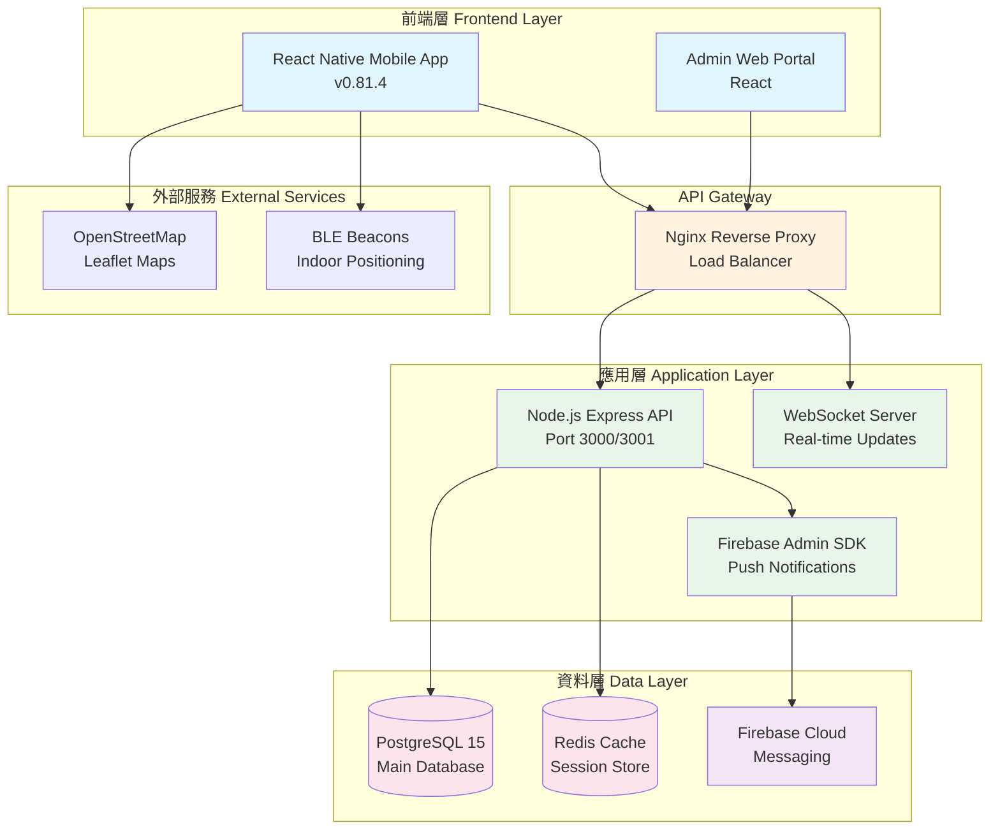

## 📊 系統工作流程

### 1. 用戶認證流程 (Authentication Workflow)

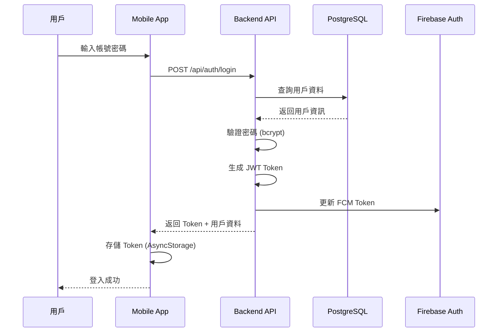

### 2. 即時定位追蹤流程 (Real-time Location Tracking)

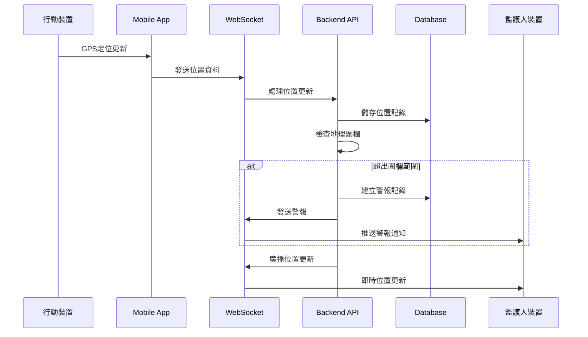

### 3. 緊急求救流程 (Emergency SOS)

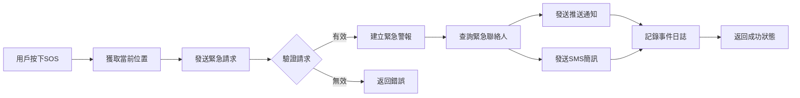

## 🔄 核心功能流程圖

### A. 患者管理系統流程

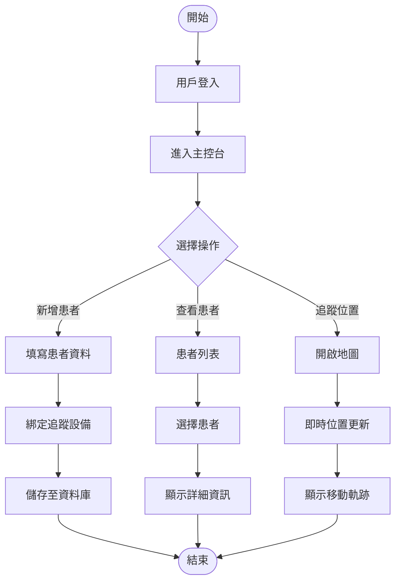

### B. 智能預測系統流程

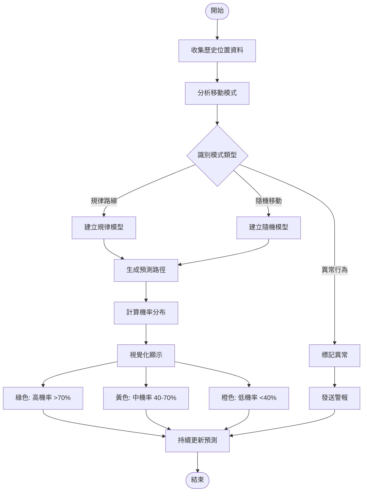

### C. 地理圍欄監控流程

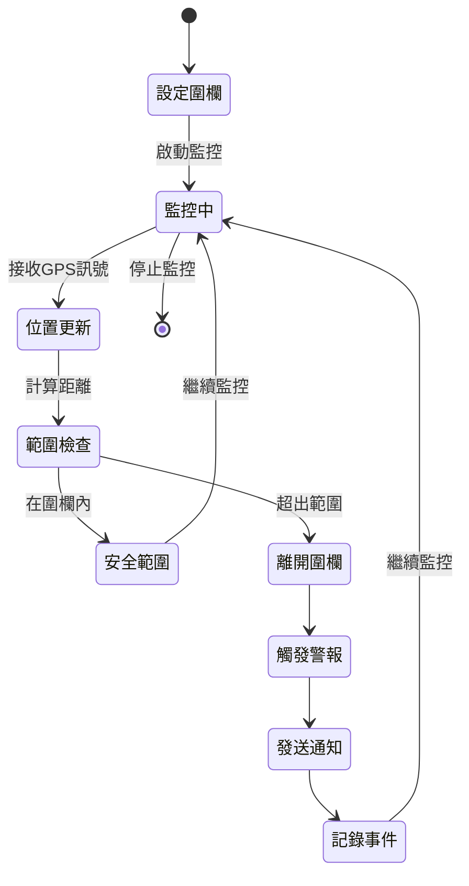

## 💻 技術棧詳細說明

### 前端技術 (Frontend)

| 技術 | 版本 | 用途 |
|-----|------|-----|
| React Native | 0.81.4 | 跨平台行動應用開發 |
| TypeScript | 5.8.3 | 型別安全的 JavaScript |
| React Navigation | 7.x | 應用程式導航管理 |
| AsyncStorage | 2.2.0 | 本地資料存儲 |
| Firebase Messaging | 23.3.1 | 推送通知服務 |
| React Native Maps | 1.26.6 | Google 地圖整合 |
| Leaflet (WebView) | - | OpenStreetMap 地圖 |
| BLE PLX | 3.5.0 | 藍牙低功耗掃描 |

### 後端技術 (Backend)

| 技術 | 版本 | 用途 |
|-----|------|-----|
| Node.js | 20.x | JavaScript 執行環境 |
| Express | 5.1.0 | Web 應用框架 |
| PostgreSQL | 15 | 主要資料庫 |
| Redis | 7-alpine | 快取與會話管理 |
| WebSocket (ws) | 8.18.3 | 即時雙向通訊 |
| JWT | 9.0.2 | 身份驗證令牌 |
| bcryptjs | 3.0.2 | 密碼加密 |
| Firebase Admin | 13.5.0 | 伺服器端 Firebase SDK |

### DevOps & 部署

| 技術 | 用途 |
|-----|-----|
| Docker | 容器化部署 |
| Docker Compose | 多容器編排 |
| Nginx | 反向代理與負載平衡 |
| GitHub Actions | CI/CD 自動化 |
| Jest | 單元測試框架 |

## 🚀 部署架構

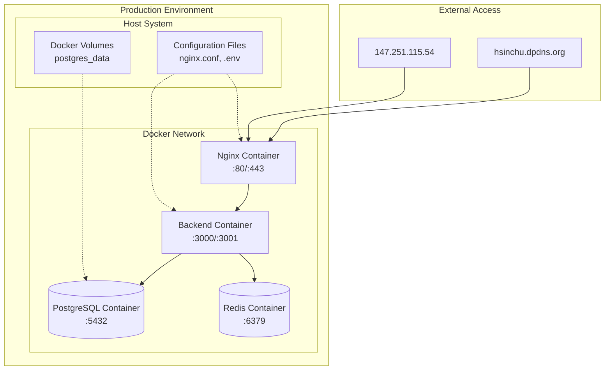

### 容器配置說明

1. **Nginx 容器**
   - 處理所有外部請求
   - SSL/TLS 終止 (預留)
   - 靜態檔案服務
   - API 請求代理

2. **Backend 容器**
   - Express API 服務 (Port 3000)
   - Admin API 服務 (Port 3001)
   - WebSocket 服務
   - Firebase 整合

3. **PostgreSQL 容器**
   - 主資料庫服務
   - 資料持久化 (Docker Volume)
   - 自動初始化腳本

4. **Redis 容器**
   - 會話存儲
   - 快取層
   - 即時資料暫存

## 📡 資料流程設計

### 資料庫架構 (ERD)

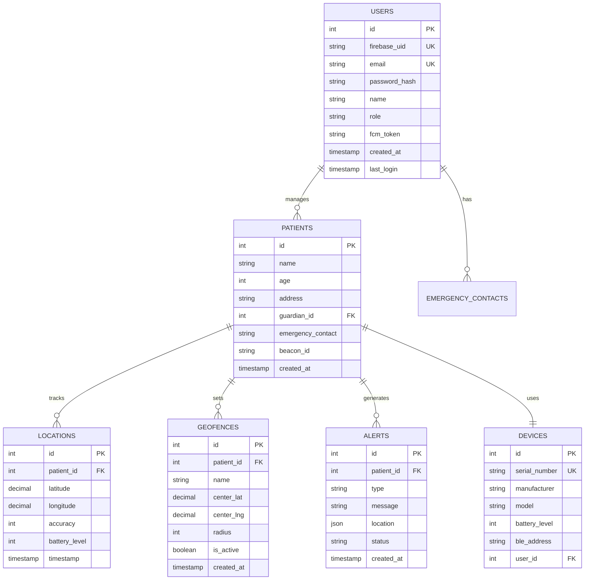

## 🔐 安全架構

### 安全層級設計

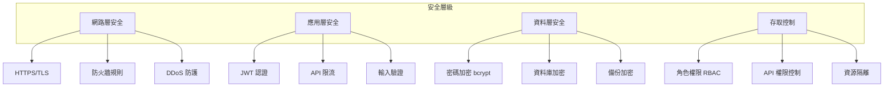

### 認證與授權流程

1. **認證 (Authentication)**
   - 用戶登入驗證
   - JWT Token 生成 (7天有效期)
   - Token 刷新機制

2. **授權 (Authorization)**
   - 角色基礎存取控制 (RBAC)
   - API 端點權限驗證
   - 資源級別權限控制

3. **資料保護**
   - 密碼: bcrypt 加鹽雜湊
   - 傳輸: HTTPS 加密 (預留)
   - 存儲: 敏感資料加密

## 📈 系統監控與維運

### 監控指標

- **效能監控**
  - API 回應時間
  - 資料庫查詢效能
  - WebSocket 連線數

- **可用性監控**
  - 服務健康檢查
  - 錯誤率追蹤
  - 系統資源使用率

- **安全監控**
  - 異常登入偵測
  - API 存取日誌
  - 錯誤事件記錄

### CI/CD 流程

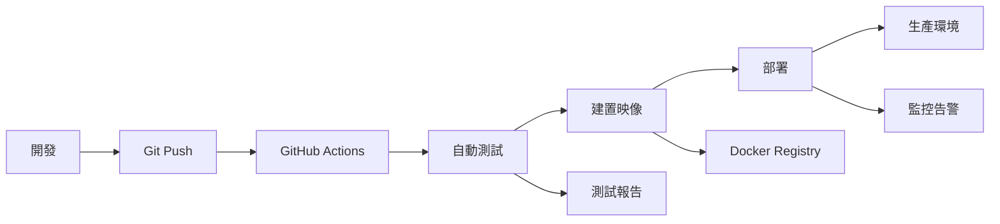

## 📝 總結

新竹市政府安心守護系統採用現代化的技術架構，結合了行動應用開發、即時通訊、地理定位、容器化部署等技術，提供了一個完整的失智症患者守護解決方案。系統具有高可用性、可擴展性和安全性，能夠有效地服務於目標用戶群體。

### 關鍵優勢
- ✅ 跨平台支援 (iOS/Android)
- ✅ 即時位置追蹤與預測
- ✅ 完整的緊急應變機制
- ✅ 容器化部署易於維護
- ✅ 模組化架構易於擴展

### 未來發展方向
- 🔄 整合 AI 行為分析
- 🔄 擴展 IoT 設備支援
- 🔄 強化機器學習預測模型
- 🔄 提升系統可擴展性

---
*文檔版本: v1.0.0*
*最後更新: 2025-01-21*
*專案版本: v2.0.0 (Backend) / v1.6.9 (Mobile)*