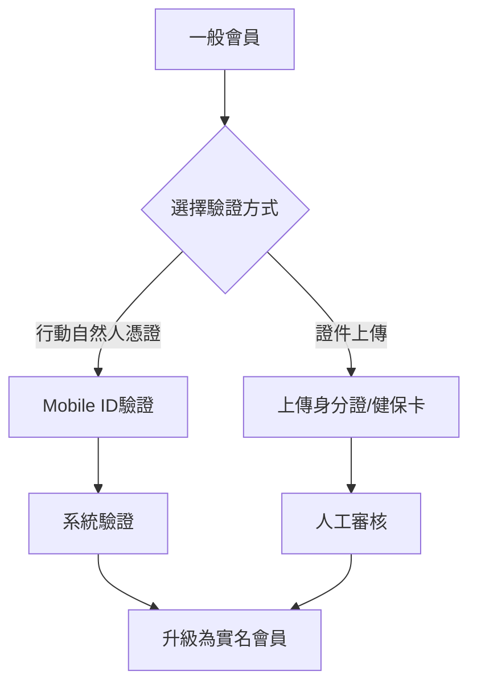

# 安心守護 - 角色權限矩陣

## 角色定義

| 角色 | 代碼 | 說明 | 驗證要求 |
|------|------|------|----------|
| 未登入用戶 | `guest` | 未登入的訪客 | 無 |
| 一般會員 | `member` | 已登入但未實名 | Email/手機驗證 |
| 實名會員 | `verified` | 已完成實名驗證 | 行動自然人憑證/證件上傳 |
| 承辦人員 | `admin` | 市府承辦人員 | 組織帳號+雙因素認證 |

## 功能權限矩陣

### 安心守護入口 (`/guardian`)

| 功能 | 未登入 | 一般會員 | 實名會員 | 承辦人員 |
|------|--------|----------|----------|----------|
| **查看入口** | ❌ 需登入 | ✅ 可見 | ✅ 可見 | ✅ 可見 |
| **進入功能** | ❌ | ✅ 受限 | ✅ 完整 | ✅ 完整+管理 |

### 家屬分頁 (`/guardian/family`)

| 功能 | 未登入 | 一般會員 | 實名會員 | 承辦人員 |
|------|--------|----------|----------|----------|
| **查看分頁** | ❌ | ⚠️ 僅見提示 | ✅ | ✅ |
| **定位追蹤** | ❌ | 🔒 需實名 | ✅ | ✅ 全域 |
| **電子圍籬** | ❌ | 🔒 需實名 | ✅ | ✅ 全域 |
| **緊急通報** | ❌ | 🔒 需實名 | ✅ | ✅ 派遣 |
| **歷史軌跡** | ❌ | 🔒 需實名 | ✅ 30天 | ✅ 無限制 |
| **綁定受照護者** | ❌ | 🔒 需實名 | ✅ 最多3人 | ✅ 無限制 |
| **推播通知** | ❌ | ❌ | ✅ | ✅ |

### 志工分頁 (`/guardian/volunteer`)

| 功能 | 未登入 | 一般會員 | 實名會員 | 承辦人員 |
|------|--------|----------|----------|----------|
| **查看分頁** | ❌ | ⚠️ 僅見提示 | ✅ | ✅ |
| **任務列表** | ❌ | 🔒 需實名 | ✅ | ✅ 全部任務 |
| **接受任務** | ❌ | 🔒 需實名 | ✅ | ✅ 指派任務 |
| **任務紀錄** | ❌ | 🔒 需實名 | ✅ 個人 | ✅ 全體 |
| **志工排班** | ❌ | 🔒 需實名 | ✅ 查看 | ✅ 編輯 |
| **即時通知** | ❌ | ❌ | ✅ | ✅ |
| **積分獎勵** | ❌ | 🔒 需實名 | ✅ | ✅ 管理 |

### 申辦分頁 (`/guardian/apply`)

| 功能 | 未登入 | 一般會員 | 實名會員 | 承辦人員 |
|------|--------|----------|----------|----------|
| **查看分頁** | ❌ | ✅ | ✅ | ✅ |
| **服務說明** | ❌ | ✅ | ✅ | ✅ |
| **申辦須知** | ❌ | ✅ | ✅ | ✅ |
| **文件下載** | ❌ | ✅ | ✅ | ✅ |
| **線上申辦** | ❌ | 🔒 需實名 | ✅ | ✅ |
| **追蹤進度** | ❌ | 🔒 需實名 | ✅ | ✅ 全部案件 |
| **MyData授權** | ❌ | 🔒 需實名 | ✅ | N/A |
| **案件審核** | ❌ | ❌ | ❌ | ✅ |

### 管理功能（承辦人員專屬）

| 功能 | 說明 | 權限等級 |
|------|------|----------|
| **案件審核** | 審核申辦案件、核准/駁回 | 承辦專屬 |
| **數據儀表板** | 查看統計數據、產生報表 | 承辦專屬 |
| **緊急派遣** | 調度志工、通知相關單位 | 承辦專屬 |
| **全域監控** | 即時查看所有受照護者位置 | 承辦專屬 |
| **系統設定** | 調整圍籬參數、通知策略 | 承辦專屬 |
| **稽核日誌** | 查看所有操作記錄 | 承辦專屬 |

## 狀態標示圖例

| 符號 | 說明 |
|------|------|
| ✅ | 完整權限 |
| ⚠️ | 部分權限/僅查看 |
| 🔒 | 需要升級權限 |
| ❌ | 無權限 |

## 權限提示文案

### 未登入用戶
- 入口點擊：「請先登入以使用安心守護功能」
- CTA：「立即登入」→ `/login?redirect=/guardian`

### 一般會員
- 家屬頁：「此功能需要完成實名驗證才能使用」
- 志工頁：「加入志工行列需要完成實名驗證」
- 申辦頁：「線上申辦需要完成實名驗證」
- CTA：「前往實名驗證」→ `/account/verification`

### 實名會員
- 無權限提示，顯示完整功能

### 承辦人員
- 額外顯示管理工具列
- 資料檢視時標註「管理員模式」

## 資料可見範圍

| 角色 | 可見資料範圍 |
|------|-------------|
| 未登入用戶 | 無 |
| 一般會員 | 公開資訊、服務說明 |
| 實名會員 | 個人綁定的受照護者資料、個人任務紀錄 |
| 承辦人員 | 所有用戶資料、所有案件、系統級數據 |

## 隱私保護機制

1. **資料最小化原則**
   - 定位資料預設保存30天
   - 可由家屬選擇延長至90/180天
   - 案件結案後立即清理個資

2. **稽核追蹤**
   - 所有資料存取皆留存紀錄
   - 匯出操作需二次確認
   - 承辦人員操作全程記錄

3. **同意管理**
   - 明確告知資料用途
   - 可隨時撤回同意
   - MyData授權獨立管理

## 實名驗證流程

## 權限變更通知

當用戶權限變更時，系統應：
1. 發送Email通知
2. App內推播通知
3. 首次登入顯示權限變更說明
4. 記錄變更日誌